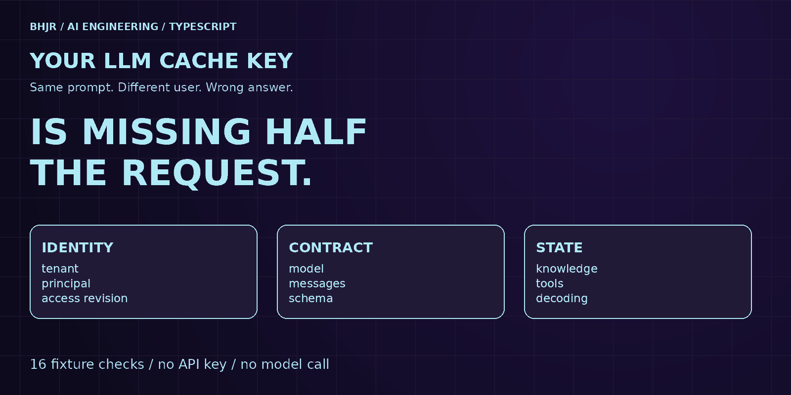

# LLM Cache Key

A small, runnable TypeScript build showing why a prompt-only cache can return the wrong user's answer.

Article: [Your LLM Cache Key Is Missing Half the Request](https://dev.to/bobbyhalljr/your-llm-cache-key-is-missing-half-the-request-build-a-versioned-cache-in-typescript-15dc). The complete article is also in [article.md](article.md).



## Purpose

Compare a deliberately broken prompt-only key with a versioned key containing trusted scope, full text request, output contract, dependency versions, and decoding settings. Sixteen guarded checks cover reuse, isolation, invalidation, expiry and bypass.

## Prerequisites and commands

Node.js 22.18.0 or newer. Tested with Node.js 22.20.0 on October 9, 2026. No packages, API keys or network calls are required after cloning.

```bash
git clone https://github.com/bobbyhalljr/llm-cache-key.git
cd llm-cache-key
npm test
```

Direct command: `node --experimental-strip-types cache.ts`.

The built-in loader strips types; this command does not type-check. Both `npm test` and `npm run demo` execute the fixture and assertions.

## Tested output

See [tested-output.txt](tested-output.txt) for the complete npm output. The final line is `checks=16 passed`.

The first line deliberately shows `prompt-only | beta/bob | ACME_LIMIT=500`. The guarded cache returns MISS for a changed tenant, user, access revision, system prompt, model snapshot, schema, toolset, knowledge revision or temperature. It hits at 999 ms and expires at 1000 ms. Missing scope and invalid decoding are refused.

## Limitations

Synthetic values and a local Map. No production authentication, live LLM, Redis, distributed invalidation, benchmark, encryption, eviction or concurrency test. Caller supplies trusted identities, fresh revisions, reliable time, and cacheability. Hashing does not authorize access. Exact schema bytes cause conservative misses. Only the narrow text request type in cache.ts is modeled; additional controls require extending and versioning the key. Never cache a side effect as though the operation happened again.

## Primary references

- [RFC 9111, section 3.5](https://www.rfc-editor.org/rfc/rfc9111.html#section-3.5), a shared-cache design analogy, not LLM cache compliance.
- [Node.js 22.20.0 TypeScript support](https://nodejs.org/download/release/v22.20.0/docs/api/typescript.html).
- [Node.js 22.20.0 createHash](https://nodejs.org/download/release/v22.20.0/docs/api/crypto.html#cryptocreatehashalgorithm-options).
